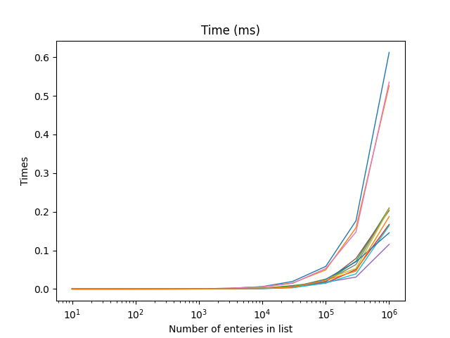

# splitseq
**splitseq**  is a module for splitting lists according to some predicate evaluated on each entry.
## Definitions
The splitseq module has three components:
- **splitseq.py** contains the code to: work with *fnmatch* providing a mechanism to pass options to the fnmatch regular expression generator; Extending fnmatch with a binary filter with the same properties and an N-way split filter that takes an external predicate or selector function. The latter allows the filter targets to be pre-specified to increase performance.
- **dictoflist.py** defines some experimental dictionary classes used in the test program.
- **test.py** is a program used to test different algorithms for splitting sequences or lists

This code requires python 3.10.

## Discussion
This module was inspired by a post I made to `python-dev/ideas` about an extension to the `fnmatch` module. It provoked a lot of discussion and I learnt a lot about programming python. Consequently I embarked on an exploration of the subject. Exploring various python modules in and out of the standard library and functional programming languages i.e. SML. Some of the results are presented in the next section.

Some the conclusion I reached are listed below, in no particular order:
- It is not easy to generate repeatable timed measurements on an operating system like Windows 10.
- Never call the predicate function more than once on element of the target list or iterables.
- Algorithms assuming the sequence is finite and can be processed completely are generally faster.
- N-Case algorithms map onto dictionaries even in functional languages.
- Predefining keys in the output directory eliminates a test for the key in the out put directory.
- Optimising the predicate function is crucial. For example searching for the regular expression `.*X.*` is much slower than `'X' in element`.
- Inline code either a `for` loop or `list comprehension` is generally faster than using a function.
- When the number of elements is less that a thousand  the algorithm used is almost irrelevant as long as the predicate function is never called twice and is reasonably streamlined.

The following is my recommended solution
```
def n_split(seq, pred, keys = []):
    out = {}
    if keys:
        for k in keys: # initialise keys
            out[k] = []
        for s in seq:
            out[pred(s)].append(s)
    else:
        for s in seq: # unknown keys
            k = pred(s)
            if k not in out: # test existence of key
                out[k] = []
            out[k].append(s)
    return out
```
It is used like this `a = n_split(b, lambda x: x[0], keys = ['a', 'b' ...])` where a is the output dictionary, b is the input list of strings beginning with lower case strings, a simple predicate returning the first character and `keys` is used to predefine the lowercase letters as valid elements. By inspection one can see it has two paths, with and without predefined `keys`. With keys is usually faster.

This code is simple but could be extended for other container types. For example the predicate function could return a key based on a dictionary elements key and value. The return could now be a dictionary of dictionaries, or even a dictionary of sets if the container were a set.

Subsequent testing has shown that `toolz.groupby` is slightly faster.
## Testing
The file `test.py` contains code that tests many different ways of splitting sequences. The following external modules are required
1. wcmatch
2. more_itertools
3. boltons
3. toolz
4. matplotlib
5. numpy

These can all be obtained from `pipy`. The function `test` contains all the tests that can be run. `testlist` at line ~490 defines exactly which tests. `output` controls the analysis to be performed.
The following test are presented below:

1. Binary RE predicate
2. Binary RE predicate, predicted
3. Binary direct predicate, not predicted
4. Binary direct predicate, predicted
5. Binary, Simply checking test character exists in name (ss)
6. Binary, inspired by CAP and simple character check
7. N Classes, not predicted
8. N Classes, predicted
9. N clases, inline, precomputing dictionary entries
10. N clases, inline, testing dictionary entries

The bar chart below shows the timing results averaged for 100 iterations with 10000 entries in the test list.


The log/log plot below shows the performance between 10 and a million entries.

It all starts to flatten off when there are less than about 500 elements in the test sequence.


Finally the log/linear plot below confirms that when the sequence length is less than about 5 thousand all algorithms are equivalent.

